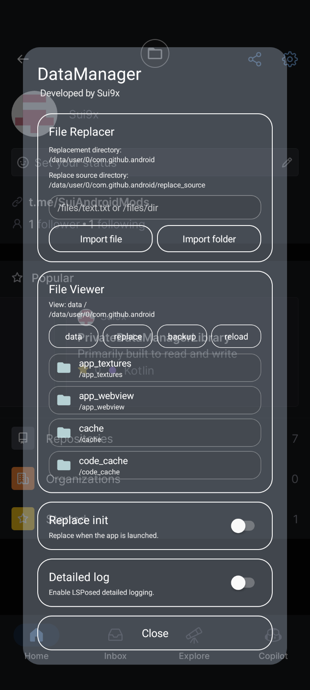

# DataManager

A rootless private-data manager module for Android apps.

DataManager is an LSPosed / LSPatch-compatible module that injects a floating file manager into Android apps.

It allows you to browse, preview, import, export, replace, back up, restore, rename, and safely delete files inside the target application's private data directory.

The module operates inside the target app process, so private app data can be accessed without requiring such as root, shizuku, sui, adb permissions.

Library: [Sui9x/PrivateDataManagerLibrary](https://github.com/Sui9x/PrivateDataManagerLibrary)

Support: [t.me/SuiAndroidMods](https://t.me/SuiAndroidMods)

> [!WARNING]
> Modifying application data can cause crashes, data loss, logout, database corruption, or unexpected application behavior.

## Features

- Floating in-app file manager
- Browse the target application's private data directory
- Browse replacement sources and backup sessions
- Text file preview
- File and directory properties
- Import files and directories with Android's Storage Access Framework
- Export files and directories
- Replace files or directories
- Automatic backup before replacement
- Automatic backup before deleting data
- Restore backup files and directories
- Merge restore for directories
- Rename backup sessions
- Delete replacement sources and backups
- Confirmation dialog before deletion
- Apply saved replacement rules when the application starts
- Support for legacy backup migration
- Works without a separate root file manager

## Screenshots

| Floating window |
|---|
|  |

## Supported environments

DataManager is designed for:

- LSPosed
- LSPatch
- NPatch-compatible environments

Behavior may differ depending on the Android version, ROM, target application, and patching framework.

## How it works

DataManager is injected into the selected target application.

Because it runs using the target application's process and UID, it can access that application's private data directory:

```text
/data/user/<user>/<package>/
```

The module creates the following internal directories:

```text
replace_source/
manager_backup/
```

### `replace_source`

Stores imported files and directories used for replacement.

The directory layout mirrors the target application's data directory.

Example:

```text
replace_source/
└── files/
    └── config.json
```

corresponds to:

```text
/data/user/<user>/<package>/files/config.json
```

### `manager_backup`

Stores backup sessions created before replacement or deletion.

Example:

```text
manager_backup/
└── 2026-07-08-21-30-00/
    ├── .manager_meta
    └── files/
        └── config.json
```

Backup sessions are labeled in the viewer:

```text
Replaced: /files/config.json
Deleted: /files/config.json
```

Older backups created under `replace_backup` are migrated automatically to `manager_backup`.

## File viewer modes

The viewer contains three modes.

### Data

Browses the target application's real private data directory.

Available operations may include:

- Preview
- Properties
- Export
- Backup and delete

Important top-level application directories are protected from direct deletion.

### Replace

Browses files stored under `replace_source`.

Available operations may include:

- Preview
- Properties
- Export
- Delete

### Backup

Browses backup sessions stored under `manager_backup`.

Available operations may include:

- Preview
- Properties
- Restore
- Rename session
- Export
- Delete permanently

## Import and replacement

Enter a relative path such as:

```text
/files/config.json
```

or:

```text
/shared_prefs
```

Then import a file or directory.

Imported content is stored inside `replace_source` and can be applied immediately.

Saved replacement path can also be configured to be automatically applied when the target application is launched.

## Backup behavior

A new backup session is created before a manual replacement.

When deleting an entry from the Data tab, DataManager first creates a recovery backup and only then deletes the original entry.

If backup creation fails, deletion does not continue.

Startup replacement can be run without creating a new backup every time the application launches.

## Restore behavior

File restores overwrite the destination file.

Directory restore supports merge behavior, allowing files from a backup directory to be copied back without necessarily removing unrelated destination files.

Review the backup path carefully before restoring.

## Legacy backup migration

Older versions used:

```text
replace_backup/
```

Current versions use:

```text
manager_backup/
```

When an older backup directory is detected, DataManager migrates its existing backup sessions automatically.

Migration completion is stored using an internal migration version.

## Safety protections

DataManager includes several protections:

- Path normalization and canonical path validation
- Manager-owned directories cannot be selected as normal application data targets
- Important top-level data directories cannot be deleted directly
- Confirmation is required before deletion
- Data deletion creates a backup first
- Backup sessions use unique timestamped directories
- Existing export destinations are not silently overwritten
- File operations are serialized to avoid concurrent import/export conflicts

These protections reduce risk, but they cannot guarantee that application data will remain valid after modification.

## Limitations

- The module can only access data available to the injected target application process.
- Some applications may crash or behave incorrectly when their data is modified while running.
- Databases, shared preferences, caches, encrypted files, and WebView data may require the application to be stopped before modification.
- File ownership, SELinux labels, extended attributes, or application-specific metadata may not always be fully preserved.
- Binary files cannot be displayed in the text preview.
- Very large files may be rejected by the preview size limit.
- Multi-process applications may behave differently depending on which process receives the hook.
- Theoretically, it should work with almost all applications, compatibility with every ROM, app, or patching framework is not guaranteed.

## Recommended usage

1. Close or stop the target application when modifying important files.
2. Open DataManager inside the target application.
3. Export or back up important data first.
4. Make one change at a time.
5. Restart the application after replacing databases, preferences, or configuration files.
6. Restore the generated backup if the application stops working correctly.

## Installation

### LSPosed

1. Install the DataManager APK.
2. Enable the module in LSPosed.
3. Select the target applications in the module scope.
4. Force-stop and restart the target application.
5. Tap the floating DataManager button.

### LSPatch / NPatch

1. Patch the target application with DataManager enabled.
2. Install the patched application.
3. Launch the target application.
4. Tap the floating DataManager button.

Exact steps may vary depending on the patching framework.

## Privacy

DataManager does not require a remote server for its core file-management operations.

All managed files, replacement sources, and backups remain inside the target application's private data directory unless you explicitly export them using Android's document picker.

## Development status

DataManager is under active development.

Test carefully before using it with important application data.

## Tips

Patching the virtual space application itself can be to access all new data of the cloned application within that virtual space.

## License

All Rights Reserved (Proprietary)

See [`LICENSE`](./LICENSE.md) for full details.
